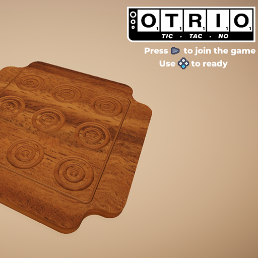
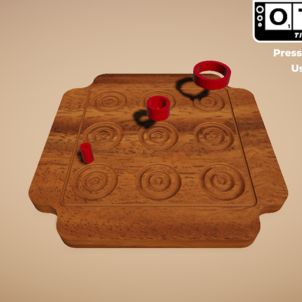
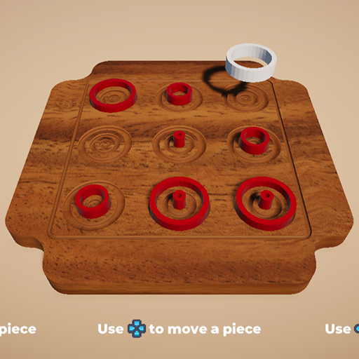

# 💿 Otrio Project 💽

**'Full Otrio Game Created In Unity w/ Controller And Keyboard Support (2-4 players)'**

---

Otrio is an engaging puzzle game that you can play with your friends. The aim of the game is to be the first to get three pieces of the same color in a row or three pieces of different shapes that are either in the same spot or in ascending or descending order. Can you outsmart your opponents and be the first to win? Try it out and see!

Play it online over on [Itch.io](https://thedevatlas.itch.io/otrio)

While it is a simple project on the surface, Otrio has a hidden depth needed to find out if a player has a legal move and if a player has won. I also used this project to learn more about game management and player management with devices using Unity's input system.

---

  
  
  

